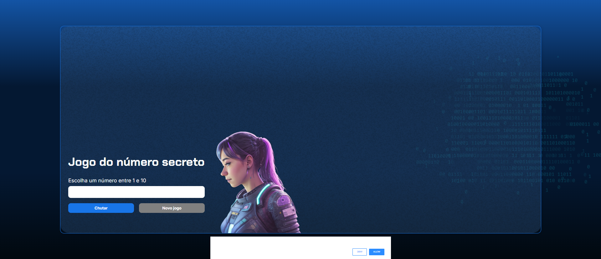

# 🔢 Número Secreto

Este projeto faz parte do curso de **Git e GitHub** da [Alura](https://www.alura.com.br/) em parceria com a **Oracle**. O objetivo principal é aprender a utilizar o Git e o GitHub na prática, trabalhando com um repositório real.

## 📚 Sobre o Projeto

O **Número Secreto** é um jogo simples onde o usuário tenta adivinhar um número gerado aleatoriamente pelo sistema. Esse repositório foi fornecido pronto para que pudéssemos praticar comandos e fluxos de versionamento com Git e GitHub, como:

- Clonar repositórios
- Criar branches
- Fazer commits
- Trabalhar com pull requests
- Resolver conflitos
- Trabalhar em colaboração

## 🚀 Tecnologias Utilizadas

- HTML
- CSS
- JavaScript
- Git
- GitHub

## 💡 Objetivo do Curso

Aprender a utilizar o **Git** como sistema de controle de versão e o **GitHub** como plataforma de hospedagem e colaboração de código, utilizando boas práticas desde o início de um projeto até a contribuição em projetos de terceiros.

## 🖥️ Como Executar Localmente

1. Clone este repositório:
   ```bash
   git clone https://github.com/Silviareis1/git-github-alura.git
   ```
2. Acesse a pasta do projeto:
   ```bash
   cd git-github-alura
   ```
3. Abra o arquivo `index.html` no seu navegador.

## 🖼️ Imagem do Projeto



## 👩‍💻 Desenvolvido por

Silvia Reis  
[Perfil no GitHub](https://github.com/Silviareis1)

---

🛠️ Projeto utilizado apenas para fins educacionais.